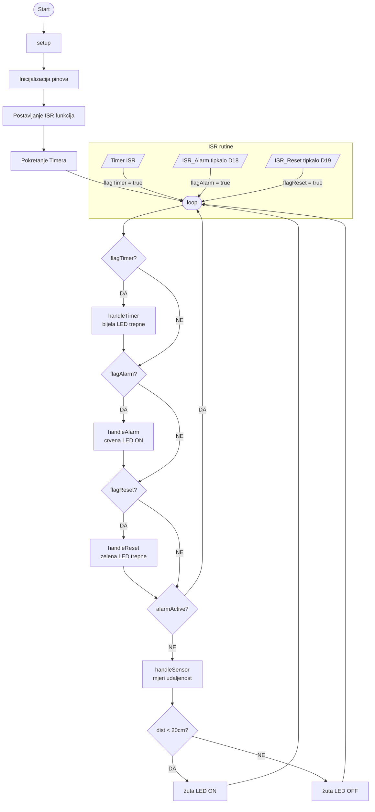
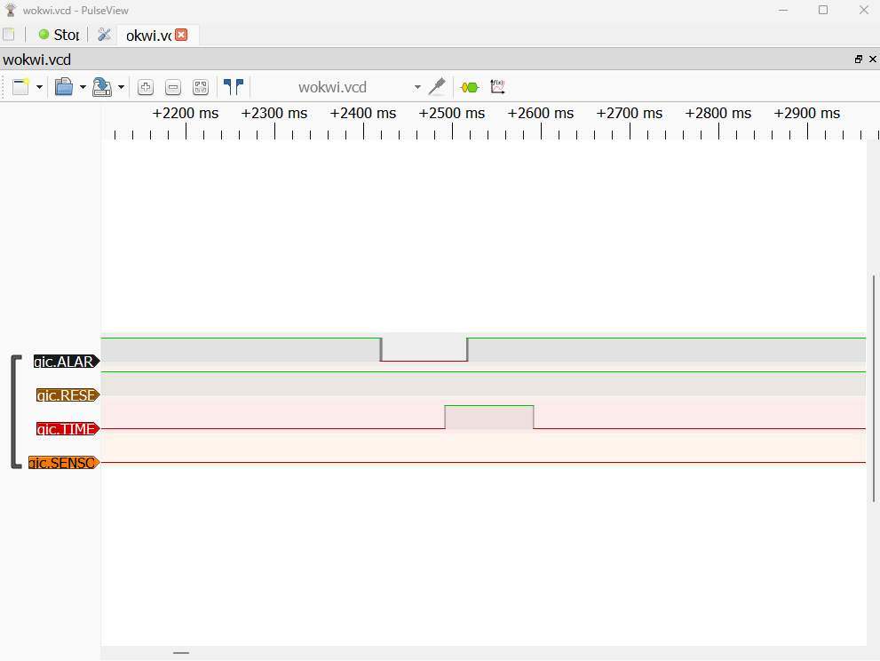

# RUS Lab1 - Sustav za nadzor prostorije

## Opis projekta
ESP32 sustav koji demonstrira rad s višestrukim prekidima i njihovim prioritetima.
Simulacija se izvodi u Wokwi simulatoru unutar VS Code + PlatformIO okruženja.

## Komponente
- ESP32 DevKit V1
- 2x tipkalo (alarm, reset)
- 4x LED (crvena, zelena, žuta, bijela)
- HC-SR04 ultrazvučni senzor
- Logički analizator

## Prekidi i prioriteti

| Prioritet | Izvor | Pin | Opis | LED indikator |
|-----------|-------|-----|------|---------------|
| 1 (najviši) | Timer | - | Trepće svake 2 sekunde | Bijela |
| 2 (visoki) | Tipkalo 1 | D18 | Aktivira alarm | Crvena |
| 3 (srednji) | Tipkalo 2 | D19 | Resetira alarm | Zelena |
| 4 (niski) | HC-SR04 senzor | D32/D33 | Objekt bliže od 20cm | Žuta |

## Upravljanje resursima
- **Zastavice (flags)** — ISR funkcije ne obrađuju prekide direktno nego postavljaju `volatile bool` zastavice koje glavna petlja obrađuje prema prioritetu
- **Debounce** — tipkala imaju 200ms debounce zaštitu od višestrukog okidanja
- **Blokiranje nižih prioriteta** — dok je alarm aktivan, senzor se ne obrađuje

## Control Flow Graph

## Testiranje logičkim analizatorom
Logički analizator prati 4 kanala:
- **D0 (ALARM)** — pin D18, signal tipkala za alarm
- **D1 (RESET)** — pin D19, signal tipkala za reset
- **D2 (TIMER)** — pin D14, signal bijele LED (timer)
- **D3 (SENSOR)** — pin D27, signal žute LED (senzor)

## Ispitivanje logičkim analizatorom

**Opis ispitivanja:**  
Na snimci se jasno vide 4 kanala:
- **ALARM** — aktivira se pritiskom crvenog tipkala (visoki prioritet)
- **RESET** — aktivira se pritiskom zelenog tipkala (srednji prioritet), 
  vidljivo nakon što ALARM signal pada
- **TIMER** — periodički signal timera (najviši prioritet)
- **SENSOR** — ostaje neaktivan dok je alarm aktivan (niski prioritet)

Snimka potvrđuje ispravnu prioritizaciju — RESET se obrađuje tek 
nakon što ALARM završi s obradom.

## Doxygen dokumentacija
HTML dokumentacija se automatski generira putem GitHub Actions i dostupna je na GitHub Pages.