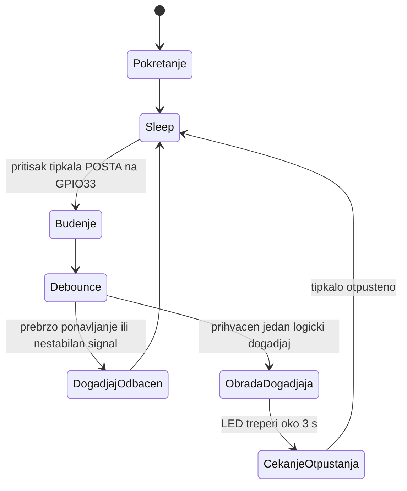

# Dijagram stanja

## Objašnjenje

Sustav nakon pokretanja ulazi u sleep stanje. Pritisak tipkala `POSTA` predstavlja vanjski događaj koji budi sustav. Nakon debounce provjere događaj se prihvaća kao jedan logički događaj, LED indikator treperi oko 3 sekunde, a sustav zatim čeka otpuštanje tipkala i vraća se u sleep.
